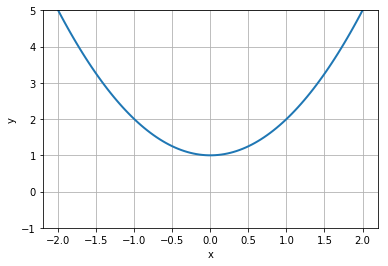
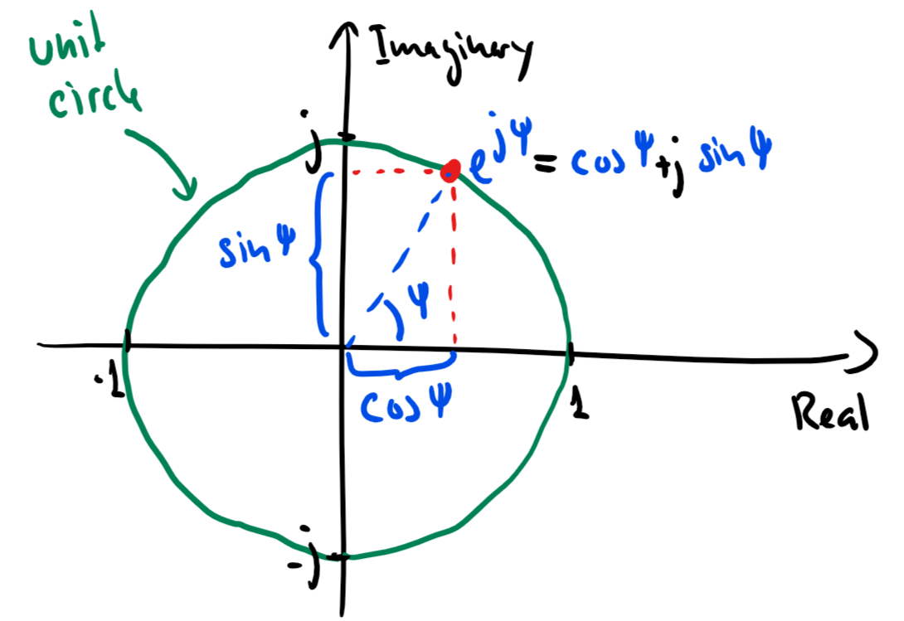

# Lecture 1: What is Sound?
Audio Processing, MED4, Aalborg University, 2019

By Jesper Kjær Nielsen (jkn@create.aau.dk), Audio Analysis Lab, Aalborg University
and Cumhur Erkut 

Last edited: 2019-02-04


## Sound and simple vibrations
In the next 20 minutes, you will learn
- What sound is and how it propagates
- How humans perceive sound
- What a sinusoid is
- that striking a bar creates a sinusoidal sound

### What is sound?
<center>
<a href="http://www.youtube.com/watch?feature=player_embedded&v=GkNJvZINSEY
" target="_blank"></a>
</center>

Sound is a **vibration** which travels through a medium as
- **longitudinal** waves: gasses (e.g., air), liquids (e.g., water), and solids (e.g., concrete)
- **transversal** sound waves: solids (e.g., concrete)
<center>

</center>

The **speed of sound** depends on the medium. In, e.g., air at room temperature, it is approximately 343 m/s.

Sound is normally divided into three types:
1. Infrasound: Sound with frequencies up to 20 Hz
2. Audible sound: Sound with frequencies in range 20 Hz - 20 kHz (this is often referred to as **audio**)
3. Ultra sound: Sound with frequencies above 20 kHz

### Human hearing
<centering>
<a href="http://www.youtube.com/watch?feature=player_embedded&v=eQEaiZ2j9oc
" target="_blank"></a>
<centering>

The human ear consists of the following parts:
- **Outer ear**: Everything on the outside of the ear drum, including the pinna
- **Middle ear**: The three bones (Malleus, Incus, Stapes) acting as a mechanical transducer between the ear drum and the oval window in the cochlea
- **Inner ear**: The cochlea which is a coiled, liqued-filled tube. Subsided in the liqued is the basilar membrane which vibrates when sound propagates through the fluid. These vibrations are converted into electrical signals by hair cells attached to the basilar membrane.
<center>

</center>

The human ear
- does not hear all frequencies equally well
- is most sensitive to frequencies around 4 kHz
- is tuned to speech
- has a really large dynamic range of up to ~120 dB (i.e., we can hear sound intensities up to ~10^12 the quietest sounds)
<center>

</center>

### Sinusoids
A sinusoid (or a sine wave) is given by
$$
    x(t) = A \cos(\Omega t + \Phi)
$$
where
- $A\geq0$ is the **amplitude**
- $\Omega$ is the **frequency** measured in radians pr. second (SI symbol **rad/s**). Is related to the frequency $f$ measured in cycles pr. second (SI symbol **Hz**) via $\Omega = 2\pi f$.
- $t$ is the **time** measured in seconds (SI symbol **s**)
- $\Phi$ is the **initial phase** measured in radians (SI symbol **rad**)

The above form of the sinusoid is often referred to as the **polar form**. By using the angle addition formula for a cosine, i.e.,
$$
    \cos(\theta+\phi) = \cos(\theta)\cos(\phi)-\sin(\theta)\sin(\phi)\ ,
$$
a sinusoid can also be written in a **rectangular form** as
$$
    x(t) = a\cos(\Omega t) + b\sin(\Omega t)
$$
where a and b are scalers given by
\begin{align}
    a &= A\cos(\Phi)\\
    b &= -A\sin(\Phi)\ .
\end{align}

#### Numpy example: A sinusoid


```python
%matplotlib inline
import numpy as np
import matplotlib.pyplot as plt

samplingFreq = 44100 # Hz
nData = 2000
time = np.arange(0,nData).T/samplingFreq # s

# Generate a sinusoid
amp = 1;
freq = 100 # Hz
initPhase = np.pi/2 # rad
sinusoid = amp*np.cos(2*np.pi*freq*time+initPhase)

# Plot the sinusoids
plt.plot(time, sinusoid, lineWidth=2)
plt.xlim((time[0],time[nData-1]))
plt.ylim((-1,1))
plt.xlabel('Time [s]')
plt.ylabel('Amplitude [.]')
plt.grid(True)
```


#### Example: Generation of a sinusoid from a vibrating bar
<br />
<center>

</center>

Assume that the act of striking a bar is modelled as **compressing a spring** in one dimension. From Hooke's law, this compresssion can be written as
$$
    F(t) = -k x(t)
$$
where
- $F(t)$ is the **restoring force** measured in Newton (SI unit **N**)
- $x(t)$ is the **displacement** measured in meters (SI unit **m**) of the string from its resting position
- $k$ is the **spring constant** measured in N/m

From **Newton's second law**, the force can also be expressed as
$$
    F(t) = ma(t)
$$
where
- $m$ is the **mass** of the string measured in kilogram (SI unit **kg**)
- $a(t)$ is the **acceleration** measured in m/s^2.
The acceleration is related to the displacement $x(t)$ as
$$
    a(t) = \frac{dv(t)}{dt} = \frac{d^2 x(t)}{d t^2}
$$
where $v(t)$ is the **velocity** measured in m/s.

Combining these three equations gives
$$
    -k x(t) = F(t) = ma(t) = m \frac{d^2 x(t)}{dt^2}
$$
which can be rewritten as
$$
    \frac{d^2 x(t)}{dt^2} = -\frac{k}{m} x(t)\ .
$$
This is a constant-coefficient second-order differential equation.

Let us check if our sinusoid
$$
    x(t) = A\cos(\Omega t + \Phi)
$$
is a solution to the above differential equation. Since
\begin{align}
    \frac{dx(t)}{dt} &= -\Omega A\sin(\Omega t + \Phi)\\
    \frac{d^2 x(t)}{d t^2} &= -\Omega^2 A\cos(\Omega t + \Phi) = -\Omega^2 x(t)\ ,
\end{align}
we obtain
$$
    -\Omega^2x(t) = -\frac{k}{m} x(t)\ .
$$
Thus, striking a bar will make it vibrate sinusoidally with the frequency
$$
    \Omega = \sqrt{k/m}\ .
$$
This frequency can be changed by changing the spring constant and mass.

### Summary
- Sound is a vibration travelling through a medium.
- Sound waves are longitudal waves (and also transversal waves when travelling through a solid).
- The human ear converts pressure variations in the air to
 1. mechanical movement (interface is the eardrum)
 2. vibrations in a liquid (interface is the oval window)
 3. electrical signal to the brain (interface is the haircells attached to the basilar membrane)
- A sinusoid (or sine wave) is given by
$$
    x(t) = A\cos(\Omega t + \Phi)\ ,
$$
and it an extremely important building block (or atom) in analysing and manipulating sound.
- Assuming that striking a bar can be modelled as compressing a spring, the bar will vibrate sinusoidally.

## Complex numbers
In the next 20 minutes, you will learn
- that the equation
$$
    x^2+1=0
$$
has two solutions
- what a complex number is
- how you add and multiply complex numbers

### The need for complex numbers
While the **linear** equation
$$
    x + 1 = 0
$$
can easily be solved, the simple **quadratic** equation
$$
    x^2 + 1 = 0
$$
was in high school said to have **no** solution since its descriminant was negative.


```python
%matplotlib inline
import numpy as np
import matplotlib.pyplot as plt

nData = 100
x = np.linspace(-2,2,nData)
y = x**2+1
plt.plot(x,y,linewidth=2)
plt.xlabel('x')
plt.ylabel('y')
plt.ylim((-1,5))
plt.grid(True);
```





However, the quadratic equation can in fact be solved by using **complex numbers**.
<center>
<a href="http://www.youtube.com/watch?feature=player_embedded&v=T647CGsuOVU
" target="_blank"></a>
</center>

Rearranging our simple **quadratic** equation gives
$$
    x^2 = -1
$$
which allows us to write the solution as
$$
    x = \pm\sqrt{-1} = \pm j
$$
where
$$
    j = \sqrt{-1}
$$
is the **imaginary unit**. This unit also satisfies that
$$
    j^2 = \sqrt{-1}^2 = -1\ .
$$

Note that
- **engineers** normally use the symbol $j$ for the imaginary unit
- **mathematicians** normally use the symbol $i$ for the imaginary unit.

Let us now consider the quadratic equation
$$
    x^2 + 2x + 5 = 0\ .
$$

We know from high school that the solutions to the general quadratic
$$
    ax^2 + bx + c = 0\ ,\qquad\text{for }a\neq0
$$
have the form
$$
    x = \frac{-b\pm\sqrt{d}}{2a}
$$
where $d$ is the **discriminant** given by
$$
    d = b^2-4ac\ .
$$

We obtain
$$
    d = 4-20 = -16
$$
so that
$$
    x = \frac{-2\pm\sqrt{-16}}{2} = -1\pm\frac{1}{2}\sqrt{-1\cdot 4^2} = -1\pm 2\sqrt{-1} = -1\pm 2j\ .
$$
Thus, the **complex numbers** $-1+2j$ and $-1-2j$ are the solutions.

### The complex number
A **complex number** can be written as
$$
    z = a + jb
$$
where
- $a = \text{Re}\{z\}$ is the **real** part
- $b = \text{Im}\{z\}$ is the **imaginary** part.

A complex number can be depicted in the **complex plane** which is a 2D coordinate system.
<center>

</center>


#### The complex conjugate
The **complex conjugate** of a complex number $z$ is
$$
    z^* = a - jb\ .
$$
Thus, the conjugation operator ${}^*$ changes the sign of imaginary part, but not the real part.

#### Addition of complex numbers
Assume we have the two complex numbers
\begin{align}
    z_1 &= a_1+jb_1\\
    z_2 &= a_2+jb_2\ .
\end{align}

The **sum** of these two numbers is then
$$
    z = z_1 + z_2 = a_1+jb_1 + a_2+jb_2 = (a_1+a_2) + j(b_1+b_2).
$$

Thus, the real and imaginary part of of $z=a+jb$ are simply
\begin{align}
    a &= a_1 + a_2\\
    b &= b_1 + b_2\ .
\end{align}

Note that
\begin{align}
    z_1 + z_1^* &= 2a_1 + 0j = 2\text{Re}(z_1)\\
    z_1 - z_1^* &= 0 + 2jb_1 = 2\text{Im}(z_1)\ .
\end{align}


#### Multiplication of complex numbers
Assume we have the two complex numbers
\begin{align}
    z_1 &= a_1+jb_1\\
    z_2 &= a_2+jb_2\ .
\end{align}

The **product** of these two numbers is then
$$
    z = z_1z_2 = (a_1+jb_1)(a_2+jb_2) = (a_1a_2-b_1b_2) + j(a_1b_2+b_1a_2).
$$

Thus, the real and imaginary part of of $z=a+jb$ are
\begin{align}
    a &= (a_1a_2-b_1b_2)\\
    b &= (a_1b_2+b_1a_2)\ .
\end{align}

Note that
$$
    z_1z_1^* = (a_1a_1-b_1(-b_1)) +j(a_1b_1-b_1a_1) = a_1^2+b_1^2 = \text{Re}(z_1)^2+\text{Im}(z_1)^2
$$

### Summary
- Complex numbers were originally invented to solve algebraic equations (e.g., the cubic equation)
- The imaginary unit is $j=\sqrt{-1}$
- A **complex number** $z$ consists of a real part $a$ and imaginary part $b$, and is written as
$$
    z = a+jb\ .
$$
- The **complex conjugate** of $z$ is
$$
    z^* = a-jb\ .
$$
- It is much easier to add two complex numbers than it is to multiply them.

### Additional information on complex numbers
If you want to know more about complex numbers (e.g., its history), you can find some nice videos here:
https://www.youtube.com/playlist?list=PLiaHhY2iBX9g6KIvZ_703G3KJXapKkNaF

### Active 5 minutes break
Let
\begin{align}
    z_1 &= a_1+jb_1 =  2+3j\\
    z_2 &= a_2+jb_2 = -1-2j\ .
\end{align}

By hand, please calculate
\begin{align}
    z_1 + z_2 &= \\
    z_1 - z_2 &= \\
    z_1 + z_1^* &= \\
    z_2 - z_2^*+2z_1 &= \\
    z_1z_2^* &=\\
    z_1^2+z_2^*z_1 &=
\end{align}
Check the results with your neighbours.

---
**Tip:** Use the rules
\begin{align}
    z_1 + z_2 &= (a_1+a_2) + j(b_1+b_2)\\
     z_1z_2 &= (a_1a_2-b_1b_2) + j(a_1b_2+b_1a_2)\ .
\end{align}

## Phasors
In the next 20 minutes, you will learn
- how a complex number can be written in a **polar form**
- why the polar form makes multiplications much easier
- what a **phasor** is
- how a phasor is related to a **real sinusoid**

### The polar (or exponential) form of a complex number
As for 2D vectors, we can also write a complex number in terms of its **magnitude** $r$ and **angle** $\psi$. We have
\begin{align}
    a &= r\cos\psi\\
    b &= r\sin\psi\ .
\end{align}
Thus,
$$
    z = a + jb = r\left(\cos\psi + j\sin\psi\right) = r\mathrm{e}^{j\psi}
$$
where the last equality follows from **Euler's formula**.
<center>

</center>

#### Euler's formula
Given by
$$
    \mathrm{e}^{j\psi} = \cos\psi + j\sin\psi\ .
$$
- A very important formula used everywhere in science and engineering
- Simplifies notation and mathematical manipulations
- Its real and imaginary parts are a cosine and a sine, respectively, i.e.,
\begin{align}
    \text{Re}(\mathrm{e}^{j\psi}) &= \cos\psi\\
    \text{Im}(\mathrm{e}^{j\psi}) &= \sin\psi\ .
\end{align}
<center>

</center>

#### The complex conjugate
The **complex conjugate** of a complex number
$$
    z=r \mathrm{e}^{j\psi}
$$
is
$$
    z^* = r \mathrm{e}^{-j\psi}\ .
$$
Thus, the conjugation operator ${}^*$ changes the sign of the angle, but not the magnitude.

#### Multiplication of complex numbers
Multiplication of complex numbers is much easier when the polar form is used. Let
\begin{align}
    z_1 &= a_1+jb_1 = r_1 \mathrm{e}^{j\psi_1}\\
    z_2 &= a_2+jb_2 = r_2 \mathrm{e}^{j\psi_2}\ .
\end{align}

The **product** of these two numbers is then
$$
    z = z_1z_2 = r_1 \mathrm{e}^{j\psi_1}r_2 \mathrm{e}^{j\psi_2} = r_1 r_2 \mathrm{e}^{j\psi_1}r_2 \mathrm{e}^{j\psi_2} = r_1 r_2 \mathrm{e}^{j(\psi_1+\psi_2)}
$$
where we used $a^na^m = a^{n+m}$ to get the last equation.

Thus, to multiply two complex numbers we
- multiply their magnitudes
- add their angles

Note that **divisions** can be calculated as multiplications since
$$
    \frac{z_1}{z_2} = z_1\frac{1}{z_2} = z_1 z_2^{-1}
$$
and
$$
    z_2^{-1} = \frac{1}{r_2}\mathrm{e}^{-j\psi_2}\ .
$$

#### Converting between the rectangular and polar forms
We have seen that a complex number $z$ can be written as
$$
    z = a+jb = r\mathrm{e}^{j\psi}\ .
$$

We can convert from the polar coordinates $(r,\psi)$ to the rectangular coordinates $(a,b)$ via
\begin{align}
    a &= r\cos\psi\\
    b &= r\sin\psi\ .
\end{align}

We can convert from the rectangular coordinates $(a,b)$ to the polar coordinates $(r,\psi)$ via
\begin{align}
    r &= \sqrt{a^2+b^2}\\
    \psi &= \mathrm{arctan2}(b,a)\ .
\end{align}

### The phasor
We have previously looked at the sinusoid
$$
    x(t) = A\cos(\Omega t + \Phi)\ .
$$

Based on what we know about Euler's formula and complex numbers, we can now also write $x(t)$ as
$$
    x(t) = \text{Re}\left[A\exp(j(\Omega t +\Psi))\right]
$$
since (from Euler's formula)
$$
    A\exp(j(\Omega t +\Psi)) = A\cos(\Omega t +\Psi)+jA\sin(\Omega t +\Psi)\ .
$$
This time-varying complex number is called a **phasor** or a **complex sinusoid**.

Note that
- using the phasor instead of the real sinusoid makes life much easier (you will see this later in the course)
- even though we work with the phasor, we can always come back to the real sinusoid by taking the real part of the phasor

<center>

</center>

<center>

</center>

### Summary
- The **polar form** of a complex number $z=a+jb$ is
$$
    z = r\mathrm{e}^{j\psi}
$$
where the magnitude $r$ and angle $\psi$ are given by
\begin{align}
    r &= \sqrt{a^2+b^2}\\
    \psi &= \mathrm{arctan2}(b,a)\ .
\end{align}
- Multiplications (and divisions) are much easier when using the polar form.
- A **phasor** is a complex sinusoid given by
$$
    z(t) = A\exp(j(\Omega t +\Psi))\ ,
$$
and its real part is a real sinusoid, i.e., 
$$
    x(t) = \text{Re}(z(t)) = A\cos(\Omega t +\Psi)\ .
$$

